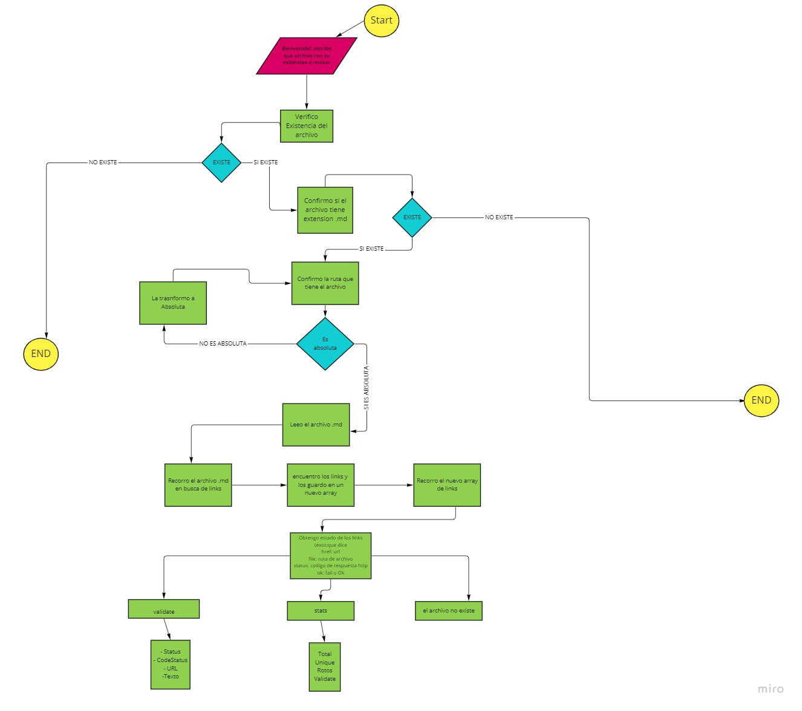
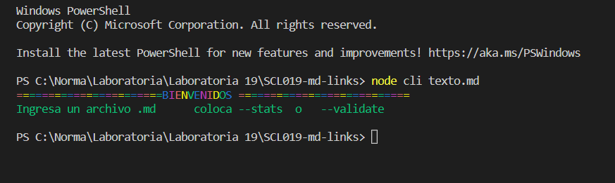
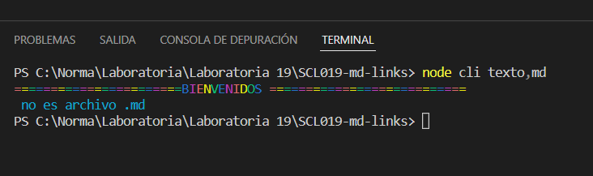
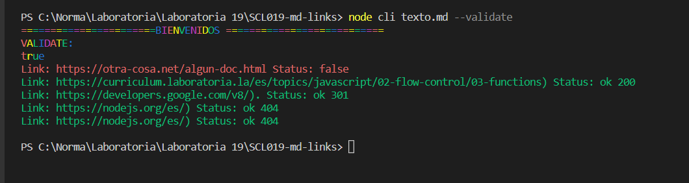
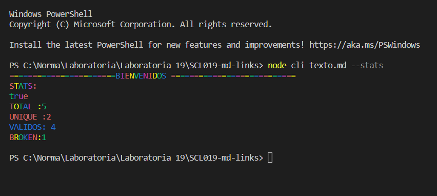
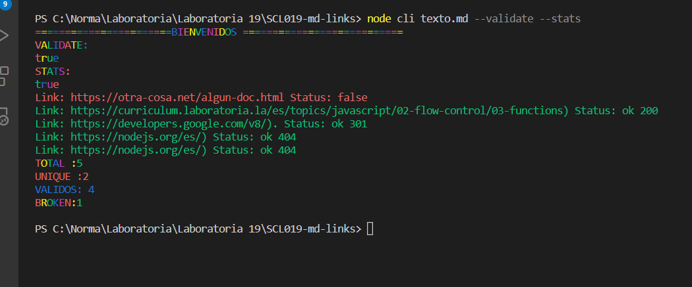

# Markdown Links

## INDICE

* [1. Características de la Librería](#1-preámbulo)
* [2. Diagrama de flujo ](#2-resumen-del-proyecto)
* [3. Como empezar](#3-objetivos-de-aprendizaje)
* [4. Modo de Uso](#4-consideraciones-generales)
* [5. Autora](#5-criterios-de-aceptación-mínimos-del-proyecto)

***

## 1. CARACTERISTICAS DE LA LIBRERIA 📋
He creado una herramienta usando [Node.js](https://nodejs.org/), que lea y analice archivos
en formato `Markdown`, para verificar los links que contengan y reportar
algunas estadísticas. 
Herramienta que nos ayudaría mucho, ya que los archivos `Markdown`  los cuales contienen _links_ (vínculos/ligas) algunas veces estan rotos o ya no son válidos y eso perjudica mucho el valor de
la información que se quiere compartir.

***

## 2. DIAGRAMA DE FLUJO

***

## 3. COMO EMPEZAR

Coloque el siguiente comando en la terminal
### npm i md-links-norma

Después de instalada la librería, en la terminal escribes lo siguiente:

***

## 4. MODO DE USO

Opcion Error

Ingresar un archivo .md

Opcion --validate

***

Opcion --stats

***

Opcion --validate --stats

***

## 5. AUTORA

NORMA BUENDIA 💻
